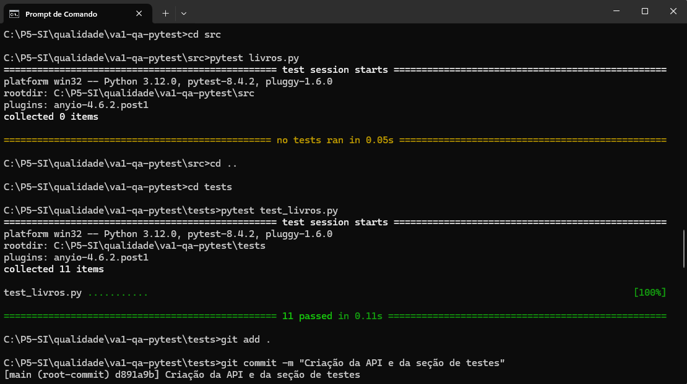

 ### CRUD de Livros - Avaliação Unidade 1
 ## Aluno: Gabriel Roberto Pinheiro Brandão

 Descrição
Aplicação simples em Python para gerenciar um catálogo de livros  
O foco do projeto é testar as regras de negócio com os testes unitários automatizados (Pytest)

 Regras de Negócio Testadas
1. Deve ser possível buscar livros pelo título  
2. Não é permitido cadastrar livros duplicados(mesmo título, independente de maiúsculas/minúsculas).  
3. A nota do livro deve estar entre 0 e 10 
4. O gênero não pode ser vazio  
5. Tentar remover um livro inexistente deve retornar False
7. O título do livro não pode ser vazio 
8. Deve ser possível remover livros do catálogo  

**Como testar**
Dentro da pasta *tests* execute o seguinte comando
 no terminal executar: `pytest test_livros.py` 

# Artefatos
 

 

